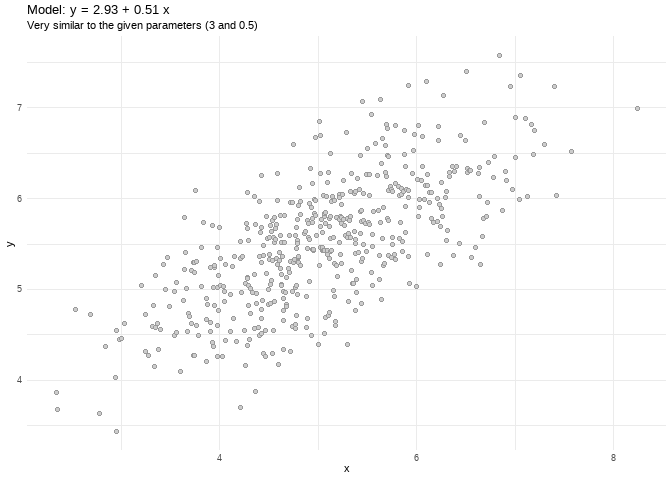
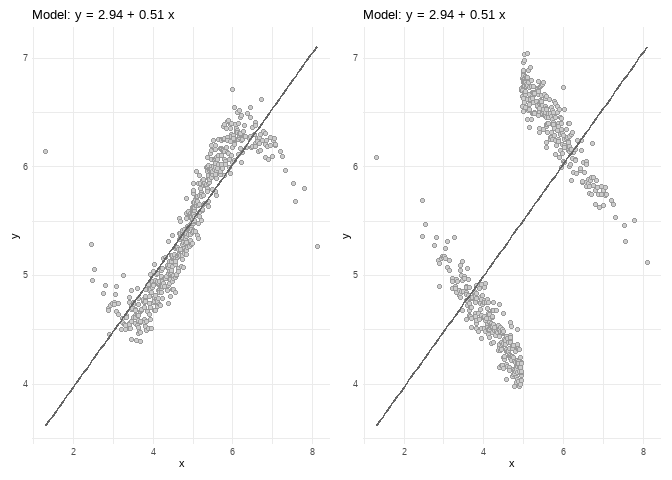
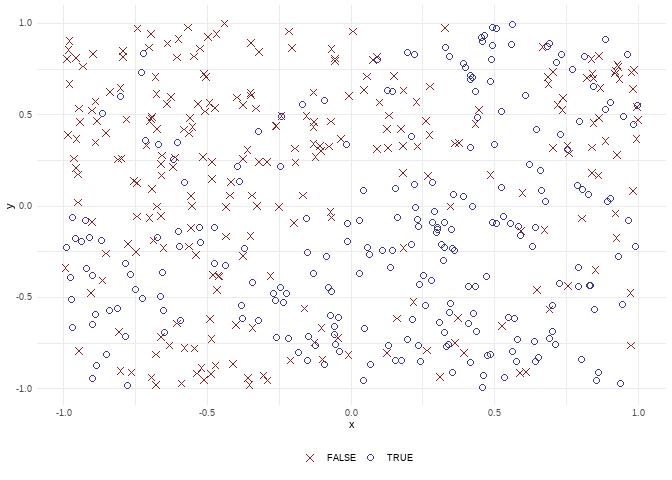
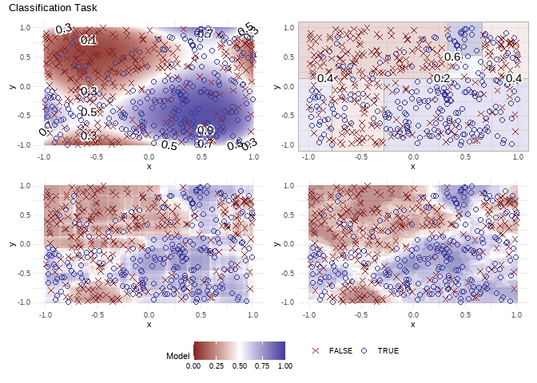
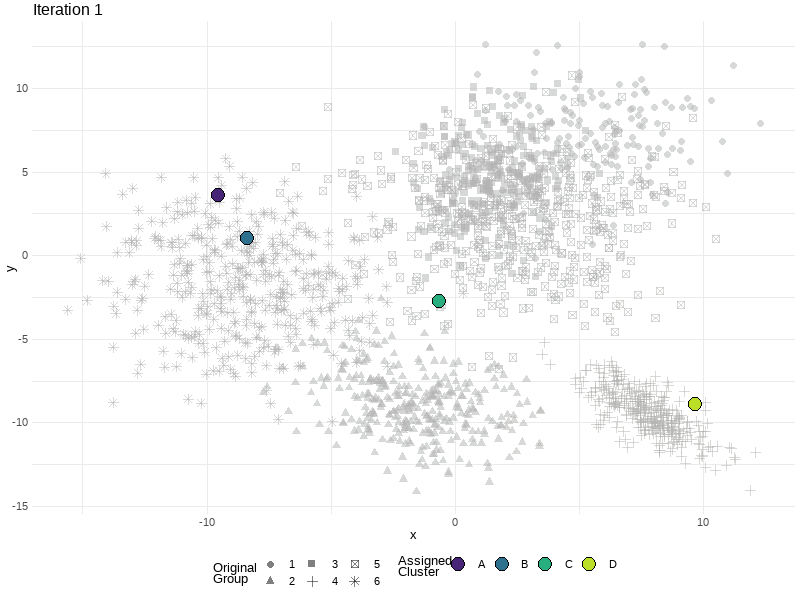

<!-- README.md is generated from README.Rmd. Please edit that file -->

# klassets

<!-- badges: start -->

[](https://github.com/jbkunst/klassets/actions)
[](https://github.com/jbkunst/klassets)
<!-- badges: end -->

The `{klassets}` package is a collection of functions to simulate data
sets to:

-   Teach how some Statistics Models and Machine Learning algorithms
    works.
-   Illustrate certain some particular events such as heteroskedasticity
    or the Simpson’s paradox.
-   Compare the predictions between models, for example logistic
    regression vs decision tree vs
    -Nearest
    Neighbours.


# Some examples

## Don’t forget to visualize the data

``` r
library(klassets)

set.seed(123)

df <- sim_quasianscombe_set_1(beta0 = 3, beta1 = 0.5)

plot(df) +
  ggplot2::labs(subtitle = "Very similar to the given parameters (3 and 0.5)")
```



``` r
library(patchwork)

df2 <- sim_quasianscombe_set_2(df, fun = sin)
df6 <- sim_quasianscombe_set_6(df, groups = 2, b1_factor = -1)

plot(df2) + plot(df6)
```



## Compare models in a classifications task

``` r
df <- sim_response_xy(relationship = function(x, y) sin(x*pi) > sin(y*pi))

df
#> # A tibble: 500 × 3
#>    response       x       y
#>    <fct>      <dbl>   <dbl>
#>  1 FALSE    -0.681   0.707 
#>  2 FALSE    -0.711   0.332 
#>  3 FALSE    -0.702   0.467 
#>  4 TRUE      0.0289 -0.371 
#>  5 TRUE     -0.0143  0.335 
#>  6 TRUE      0.233  -0.0722
#>  7 FALSE    -0.105   0.301 
#>  8 FALSE    -0.889   0.572 
#>  9 FALSE    -0.989   0.803 
#> 10 FALSE    -0.556   0.0548
#> # … with 490 more rows

plot(df)
```



You can fit different models and see how the predictions are made.

``` r
plot(fit_logistic_regression(df, order = 4)) +
plot(fit_classification_tree(df))            +
plot(fit_classification_random_forest(df))   +
plot(fit_knn(df))                            +
  plot_layout(guides = "collect")
```



## How -means works

Another example of what can be done with `{klassets}`.



## Where to start

You can check:

-   `vignette("Quasi-Anscombe-data-sets")` to know more about
    `sim_quasianscombe_set*` functions family.
-   `vignette("Binary-classification")`/`vignette("Regression")` to see
    classifiers/regression models/methods.
-   `vignette("Clustering")` to see clustering functions.
-   `vignette("MNIST")` to work with this data set to compare models and
    check some variable importance metrics.

## Installation

You can install the development version of klassets from
[GitHub](https://github.com/) with:

``` r
# install.packages("remotes")
remotes::install_github("jbkunst/klassets")
```

## Extra Info(?!)

**Why the name Klassets?** Just a weird merge for Class/Klass and sets.

Some inspiration and similar ideas:

-   <https://jumpingrivers.github.io/datasauRus/>
-   <https://eliocamp.github.io/metamer/>
-   <http://www.econometricsbysimulation.com/2019/03/the-importance-of-graphing-your-data.html>
    This is almost the same, but the approach it’s different.
