# Binary classification

## Generating data set

The main function is `sim_response_xy`, you need to define:

- A number of observations to simulate.
- Distributions to sample $`x`$ and $`y`$. For example
  `purrr::partial(runif, min = -1, max = 1)`.
- A function to define the relation between the response and the $`x`$
  and $`y`$, for example `function(x, y) x > y` This function must
  return a logical value.
- A number to define the noise in the generated data.

``` r

library(klassets)
library(ggplot2)
library(patchwork)

set.seed(123)

df_default <- sim_response_xy(n = 500)

df_default
#> # A tibble: 500 × 3
#>    response       x        y
#>    <fct>      <dbl>    <dbl>
#>  1 FALSE    -0.425  -0.293  
#>  2 TRUE      0.577  -0.267  
#>  3 FALSE    -0.182  -0.426  
#>  4 TRUE      0.766  -0.840  
#>  5 TRUE      0.881  -0.269  
#>  6 FALSE    -0.909  -0.644  
#>  7 FALSE     0.0562  0.0721 
#>  8 TRUE      0.785   0.00790
#>  9 TRUE      0.103   0.890  
#> 10 TRUE     -0.0868 -0.317  
#> # ℹ 490 more rows

plot(df_default)
```

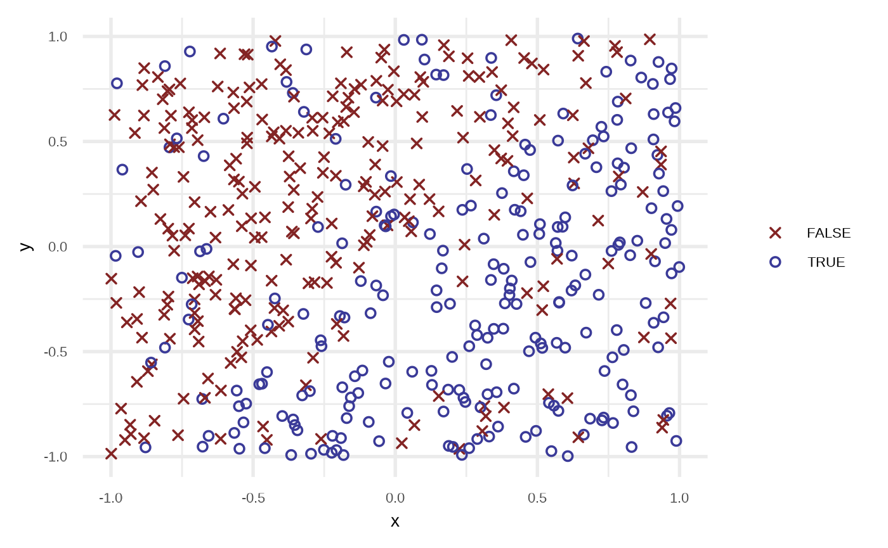

``` r


df <- sim_response_xy(
  n = 500, 
  x_dist = purrr::partial(runif, min = -1, max = 1),
  # relationship = function(x, y) sqrt(abs(x)) - x - 0.5 > sin(y),
  relationship = function(x, y) sin(x*pi) > sin(y*pi),
  noise = 0.15
  )

plot(df)
```

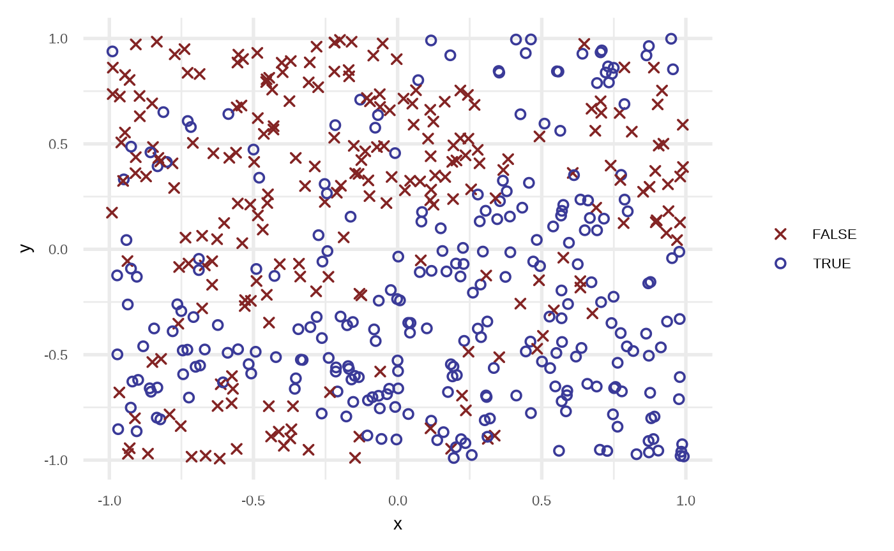

## Fit classification algorithms

### Logistic Regression

``` r

df_lr <- fit_logistic_regression(df)

df_lr
#> # A tibble: 500 × 4
#>    response       x       y prediction
#>    <fct>      <dbl>   <dbl>      <dbl>
#>  1 TRUE      0.876  -0.681       0.885
#>  2 TRUE      0.976  -0.711       0.899
#>  3 TRUE     -0.0874 -0.702       0.745
#>  4 FALSE    -0.539   0.0289      0.385
#>  5 TRUE      0.391  -0.0143      0.637
#>  6 FALSE     0.113   0.233       0.478
#>  7 TRUE      0.169  -0.105       0.614
#>  8 FALSE    -0.133  -0.889       0.785
#>  9 FALSE    -0.148  -0.989       0.807
#> 10 TRUE      0.194  -0.556       0.760
#> # ℹ 490 more rows

plot(df_lr)
```

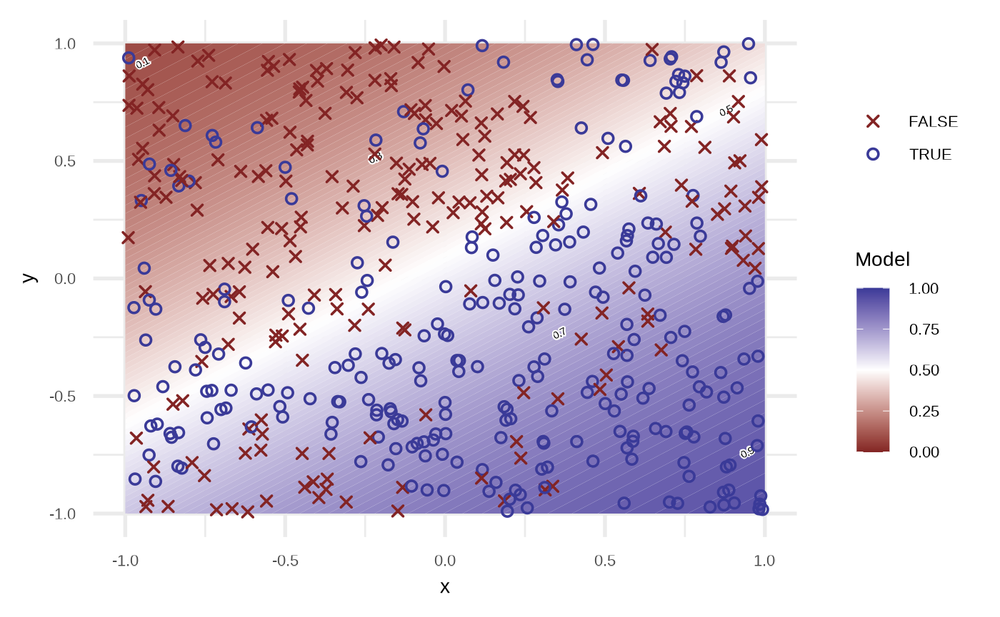

By default the model use `order = 1` of the variables, i.e,
`response ~ x + y`. We can get a better fit if we increase the order.

``` r

df_lr2 <- fit_logistic_regression(df, order = 4, stepwise = TRUE)

attr(df_lr2, "model")
#> 
#> Call:  glm(formula = response ~ x + y + x_3 + y_3, family = binomial, 
#>     data = df)
#> 
#> Coefficients:
#> (Intercept)            x            y          x_3          y_3  
#>      0.1533       3.3121      -4.4480      -3.3786       4.6436  
#> 
#> Degrees of Freedom: 499 Total (i.e. Null);  495 Residual
#> Null Deviance:       690.8 
#> Residual Deviance: 518   AIC: 528

plot(df_lr2)
```

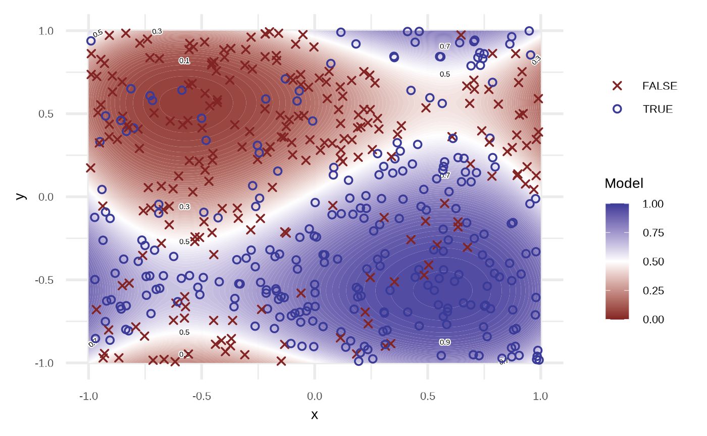

Testing various orders.

``` r

orders <- c(1, 2, 3, 4)

orders |> 
  purrr::map(fit_logistic_regression, df = df) |> 
  purrr::map(plot) |> 
  purrr::reduce(`+`) +
  patchwork::plot_layout(guides = "collect") &
  theme_void() + theme(legend.position = "none")
```

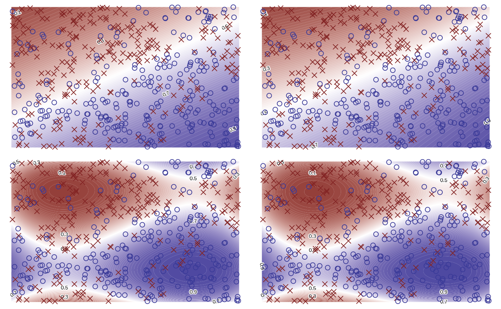

### Classification Tree

([`partykit::ctree`](https://rdrr.io/pkg/partykit/man/ctree.html))

``` r

df_rt <- fit_classification_tree(df)

plot(df_rt)
```

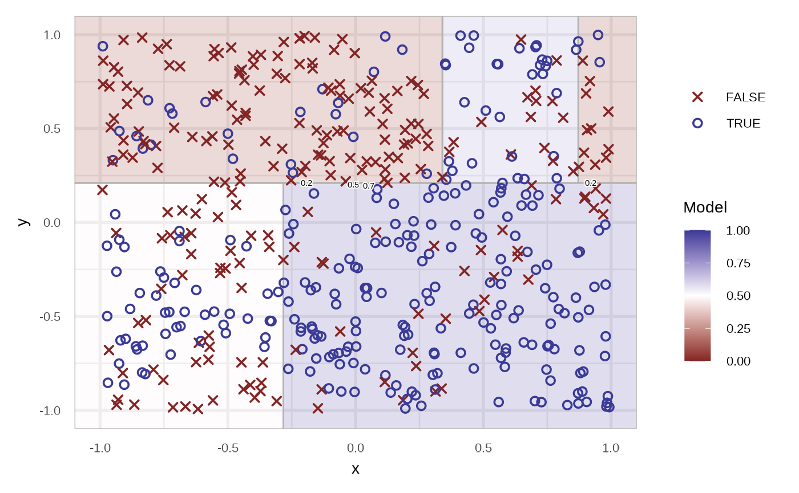

``` r


plot(fit_classification_tree(df, alpha = 0.25))
```

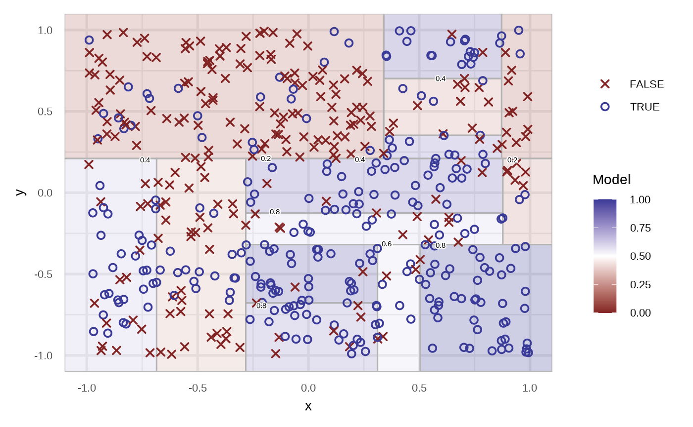

The region are filled with the probability of the respective node. We
can specify the type of the prediction using the `type` argument. In the
case of `response`.

``` r

df_rt_response <- fit_classification_tree(df, type = "response")

df_rt_response
#> # A tibble: 500 × 4
#>    response       x       y prediction
#>    <fct>      <dbl>   <dbl> <fct>     
#>  1 TRUE      0.876  -0.681  TRUE      
#>  2 TRUE      0.976  -0.711  TRUE      
#>  3 TRUE     -0.0874 -0.702  TRUE      
#>  4 FALSE    -0.539   0.0289 FALSE     
#>  5 TRUE      0.391  -0.0143 TRUE      
#>  6 FALSE     0.113   0.233  FALSE     
#>  7 TRUE      0.169  -0.105  TRUE      
#>  8 FALSE    -0.133  -0.889  TRUE      
#>  9 FALSE    -0.148  -0.989  TRUE      
#> 10 TRUE      0.194  -0.556  TRUE      
#> # ℹ 490 more rows

plot(df_rt_response)
```

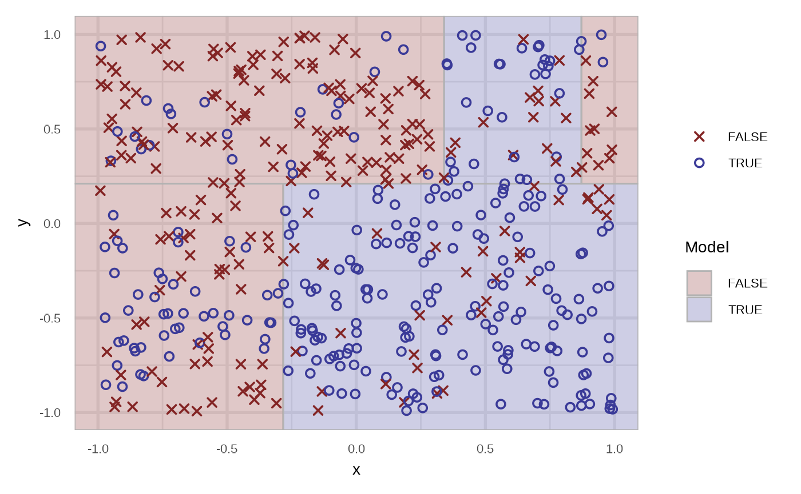

And now for the `node`.

``` r

df_rt_node <- fit_classification_tree(df, type = "node", maxdepth = 3)

df_rt_node
#> # A tibble: 500 × 4
#>    response       x       y prediction
#>    <fct>      <dbl>   <dbl>      <int>
#>  1 TRUE      0.876  -0.681           4
#>  2 TRUE      0.976  -0.711           4
#>  3 TRUE     -0.0874 -0.702           4
#>  4 FALSE    -0.539   0.0289          3
#>  5 TRUE      0.391  -0.0143          4
#>  6 FALSE     0.113   0.233           6
#>  7 TRUE      0.169  -0.105           4
#>  8 FALSE    -0.133  -0.889           4
#>  9 FALSE    -0.148  -0.989           4
#> 10 TRUE      0.194  -0.556           4
#> # ℹ 490 more rows

plot(df_rt_node)
```

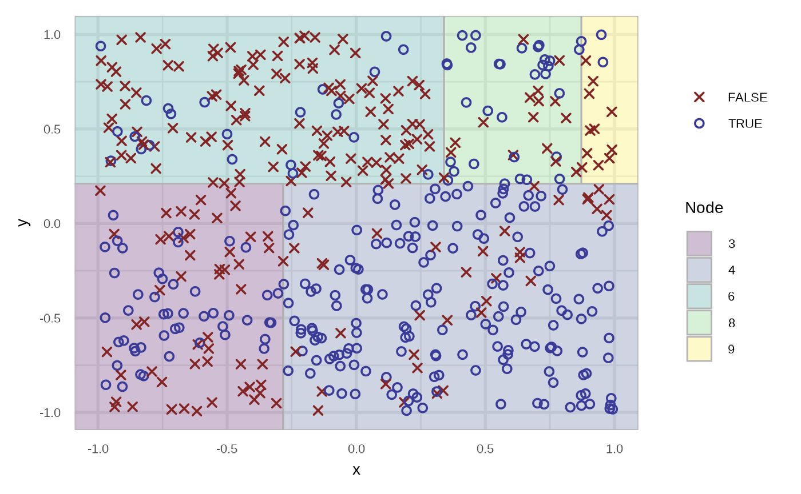

``` r


plot(attr(df_rt_node, "model"))
```

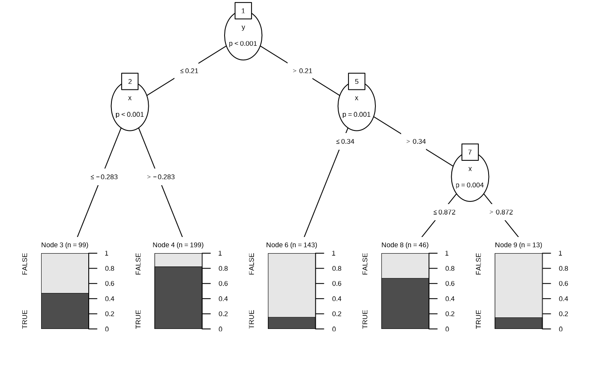

### K Nearest Neighbours

With the [`class::knn`](https://rdrr.io/pkg/class/man/knn.html)
implementation.

``` r

# defaults to prob
fit_knn(df)
#> # A tibble: 500 × 4
#>    response       x       y prediction
#>    <fct>      <dbl>   <dbl>      <dbl>
#>  1 TRUE      0.876  -0.681         1  
#>  2 TRUE      0.976  -0.711         1  
#>  3 TRUE     -0.0874 -0.702         1  
#>  4 FALSE    -0.539   0.0289        0.9
#>  5 TRUE      0.391  -0.0143        0.8
#>  6 FALSE     0.113   0.233         0.8
#>  7 TRUE      0.169  -0.105         0.9
#>  8 FALSE    -0.133  -0.889         0.8
#>  9 FALSE    -0.148  -0.989         0.6
#> 10 TRUE      0.194  -0.556         0.7
#> # ℹ 490 more rows

fit_knn(df, type = "response")
#> # A tibble: 500 × 4
#>    response       x       y prediction
#>    <fct>      <dbl>   <dbl> <fct>     
#>  1 TRUE      0.876  -0.681  TRUE      
#>  2 TRUE      0.976  -0.711  TRUE      
#>  3 TRUE     -0.0874 -0.702  TRUE      
#>  4 FALSE    -0.539   0.0289 FALSE     
#>  5 TRUE      0.391  -0.0143 TRUE      
#>  6 FALSE     0.113   0.233  FALSE     
#>  7 TRUE      0.169  -0.105  TRUE      
#>  8 FALSE    -0.133  -0.889  TRUE      
#>  9 FALSE    -0.148  -0.989  TRUE      
#> 10 TRUE      0.194  -0.556  TRUE      
#> # ℹ 490 more rows

plot(fit_knn(df))
```

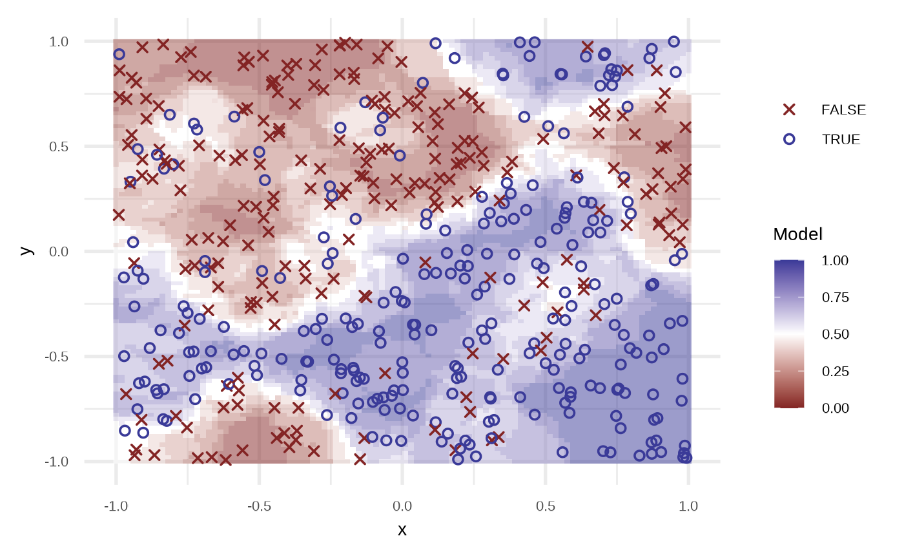

``` r


neighbours <- c(3, 10, 50, 300)

purrr::map(neighbours, fit_knn, df = df) |> 
  purrr::map(plot) |> 
  purrr::reduce(`+`) +
  patchwork::plot_layout(guides = "collect") &
  theme_void() + theme(legend.position = "none")
```

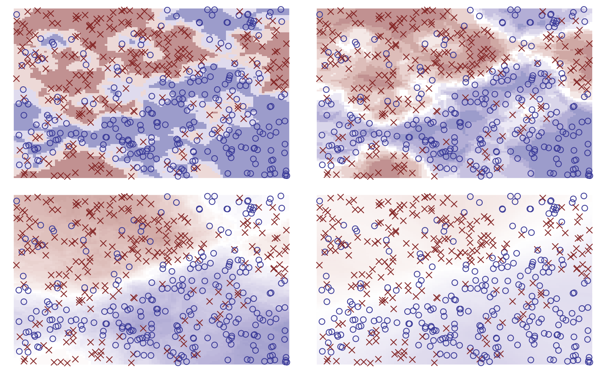

``` r


purrr::map(neighbours, fit_knn, df = df, type = "response") |> 
  purrr::map(plot) |> 
  purrr::reduce(`+`) +
  patchwork::plot_layout(guides = "collect")  &
  theme_void() + theme(legend.position = "none")
```

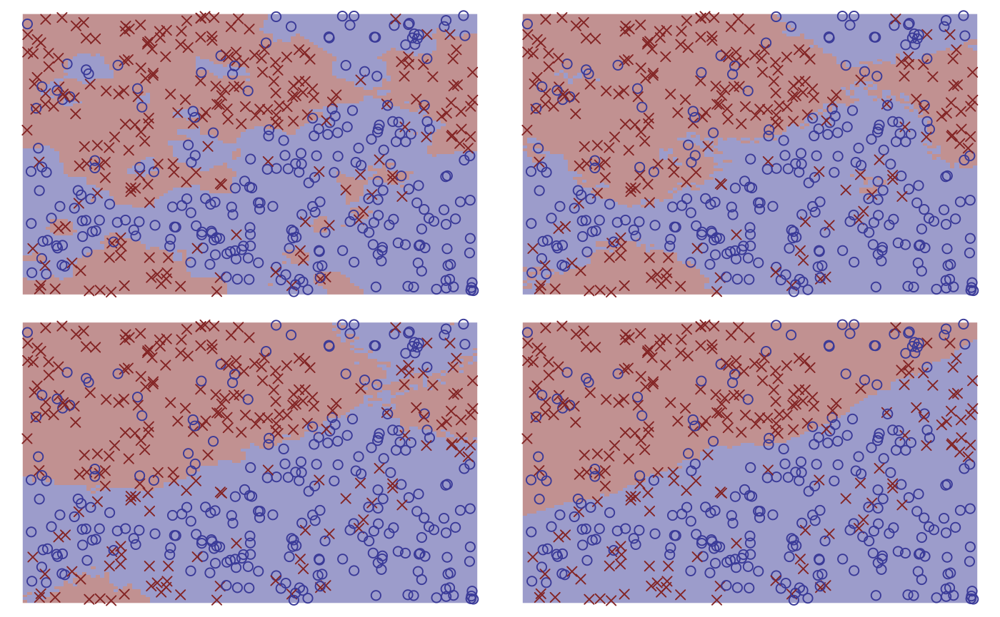

### Random Forest

Using the
[`ranger::ranger`](http://imbs-hl.github.io/ranger/reference/ranger.md)
function.

``` r

df_crf <- fit_classification_random_forest(df)

plot(df_crf)
```

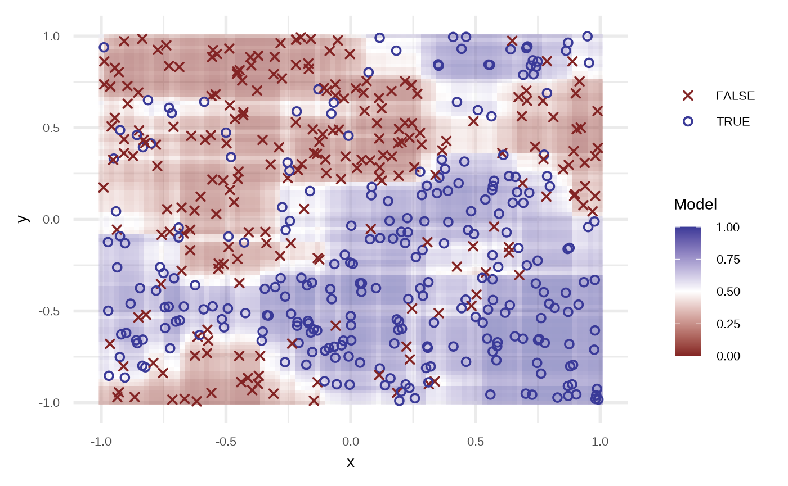

``` r


df_crf
#> # A tibble: 500 × 4
#>    response       x       y prediction
#>    <fct>      <dbl>   <dbl>      <dbl>
#>  1 TRUE      0.876  -0.681       0.984
#>  2 TRUE      0.976  -0.711       0.952
#>  3 TRUE     -0.0874 -0.702       0.905
#>  4 FALSE    -0.539   0.0289      0.173
#>  5 TRUE      0.391  -0.0143      0.899
#>  6 FALSE     0.113   0.233       0.264
#>  7 TRUE      0.169  -0.105       0.946
#>  8 FALSE    -0.133  -0.889       0.702
#>  9 FALSE    -0.148  -0.989       0.500
#> 10 TRUE      0.194  -0.556       0.922
#> # ℹ 490 more rows
```
