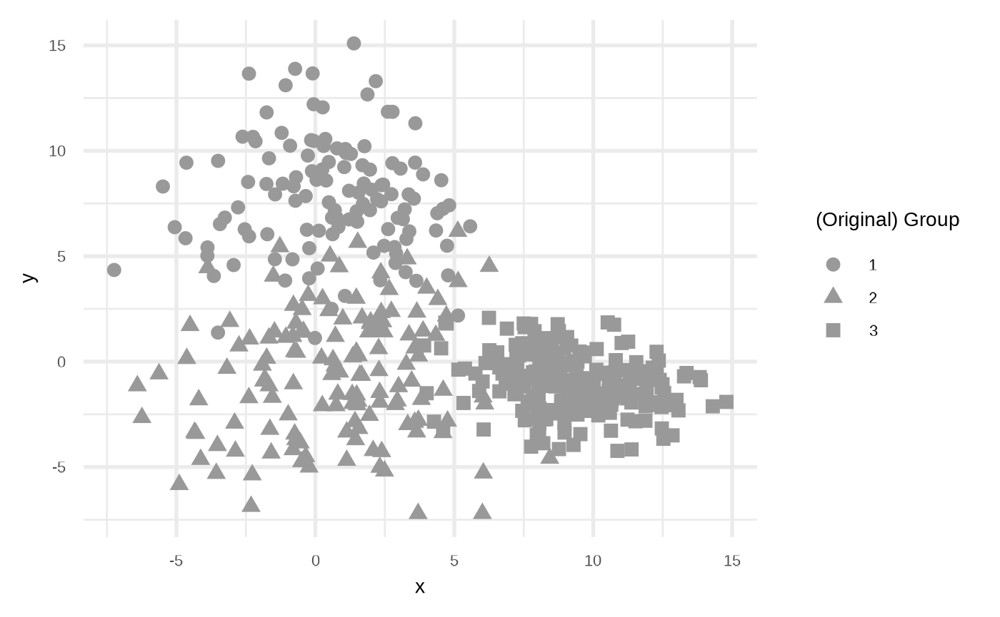
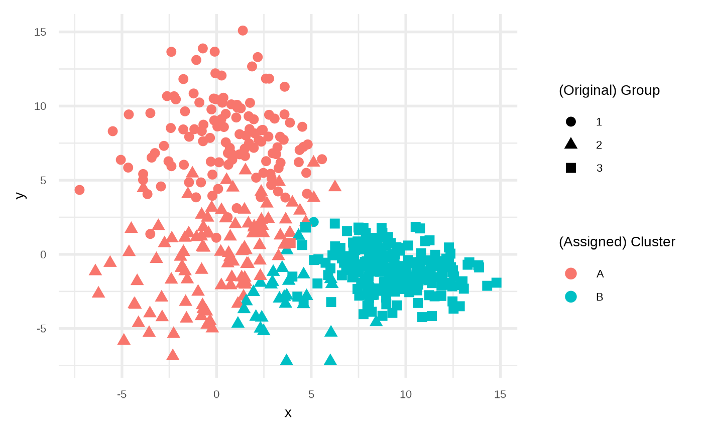
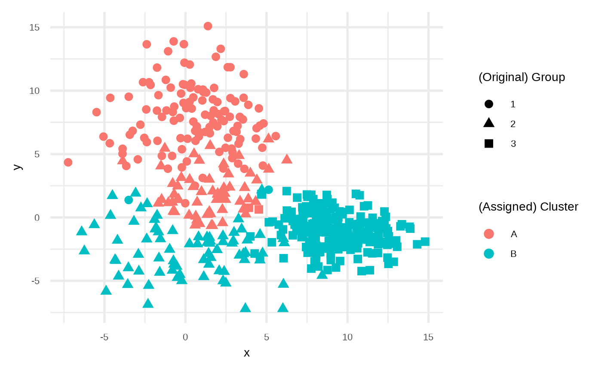
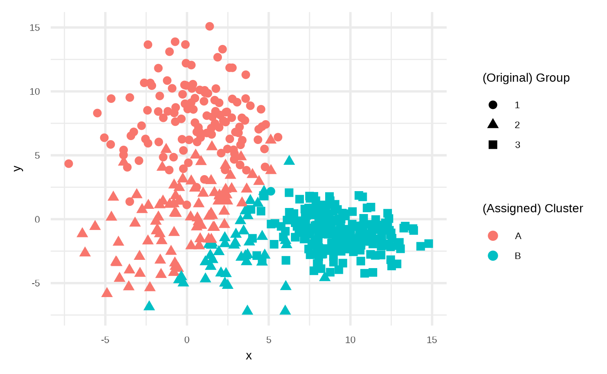
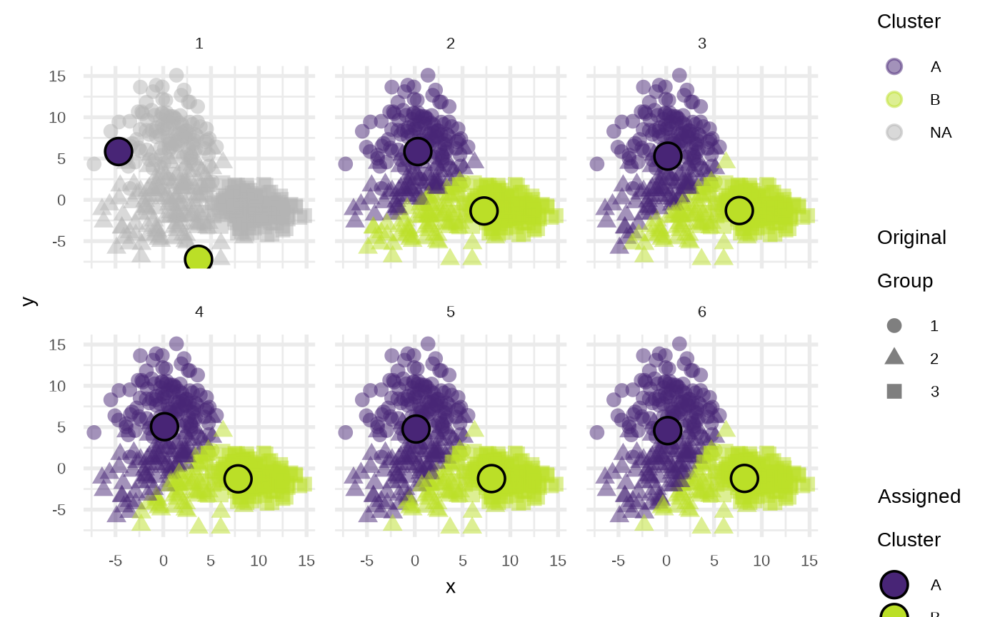

# Clustering

## Generating data set

The main function is `sim_groups`, you need to define:

- A number of observations to draw.
- A number of groups to sample.
- An optional argument to define the proportion of each group.

``` r

library(klassets)

set.seed(123)

df <- sim_groups(n = 500, groups = 3)

plot(df)
```



## Fit cluster algorithms

### K-means `stats::kmeans`

You can apply the [`stats::kmeans`](https://rdrr.io/r/stats/kmeans.html)
using `fit_statskmeans_clust`.

``` r

dfc1 <- fit_statskmeans(df, centers = 2)

plot(dfc1)
```



### Hierarchical Clustering `stats::hclust`

``` r

dfhc <- fit_hclust(df, k = 2)

plot(dfhc)
```



### K-means: Basic {klassets} implementation

Or use a basic K-means implementation with:

``` r

set.seed(234)

dfc2 <- fit_kmeans(df, centers = 2, max_iteration = 6)

plot(dfc2)
```



What is the benefit? In the second one use a helper function
`kmeans_iterations` to keep the iteration and see how the algorithm
converges.

``` r

set.seed(234)

kmi <- kmeans_iterations(df, centers = 2, max_iteration = 6)

plot(kmi)
```



Now we can use `gganimate` package using object result from
`kmeans_iterations` due have the classification for every point in every
step:

``` r

kmi
#> $points
#> # A tibble: 2,988 × 6
#>    iteration    id group      x     y cluster
#>        <int> <int> <chr>  <dbl> <dbl> <fct>  
#>  1         1     1 1      4.53   8.60 NA     
#>  2         1     2 1      5.57   6.42 NA     
#>  3         1     3 1      2.62   6.28 NA     
#>  4         1     4 1      4.82   7.41 NA     
#>  5         1     5 1      0.583  2.50 NA     
#>  6         1     6 1     -5.49   8.30 NA     
#>  7         1     7 1      3.59   9.44 NA     
#>  8         1     8 1     -0.224  3.95 NA     
#>  9         1     9 1     -2.62  10.7  NA     
#> 10         1    10 1     -0.695  8.74 NA     
#> # ℹ 2,978 more rows
#> 
#> $centers
#> # A tibble: 12 × 4
#>    iteration cluster     cx    cy
#>        <int> <fct>    <dbl> <dbl>
#>  1         1 A       -4.67   5.85
#>  2         1 B        3.70  -7.21
#>  3         2 A        0.327  5.85
#>  4         2 B        7.26  -1.35
#>  5         3 A        0.170  5.29
#>  6         3 B        7.65  -1.30
#>  7         4 A        0.132  5.05
#>  8         4 B        7.83  -1.27
#>  9         5 A        0.137  4.76
#> 10         5 B        8.04  -1.24
#> 11         6 A        0.155  4.57
#> 12         6 B        8.19  -1.22
#> 
#> attr(,"class")
#> [1] "klassets_kmiterations" "list"
```

So you can take the output of this function data and use `gganimate` to
make the animation using in the `klassets` home page. The code used in
that animation can be found in the package using:

``` r

system.file("animation_kmeans_iterations.R", package = "klassets")
#> [1] "/home/runner/work/_temp/Library/klassets/animation_kmeans_iterations.R"
```
