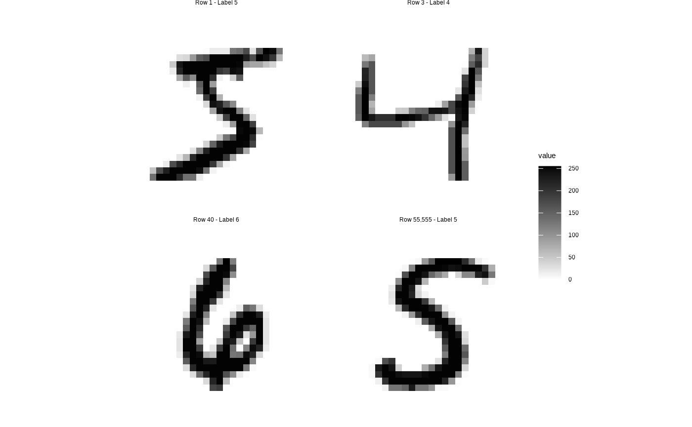

# Working on MNIST data

## Data set

``` r

library(klassets)

data("mnist_train")

mnist_train
#> # A tibble: 60,000 × 785
#>    label pixel_01x01 pixel_01x02 pixel_01x03 pixel_01x04 pixel_01x05 pixel_01x06
#>    <fct>       <dbl>       <dbl>       <dbl>       <dbl>       <dbl>       <dbl>
#>  1 5               0           0           0           0           0           0
#>  2 0               0           0           0           0           0           0
#>  3 4               0           0           0           0           0           0
#>  4 1               0           0           0           0           0           0
#>  5 9               0           0           0           0           0           0
#>  6 2               0           0           0           0           0           0
#>  7 1               0           0           0           0           0           0
#>  8 3               0           0           0           0           0           0
#>  9 1               0           0           0           0           0           0
#> 10 4               0           0           0           0           0           0
#> # ℹ 59,990 more rows
#> # ℹ 778 more variables: pixel_01x07 <dbl>, pixel_01x08 <dbl>,
#> #   pixel_01x09 <dbl>, pixel_01x10 <dbl>, pixel_01x11 <dbl>, pixel_01x12 <dbl>,
#> #   pixel_01x13 <dbl>, pixel_01x14 <dbl>, pixel_01x15 <dbl>, pixel_01x16 <dbl>,
#> #   pixel_01x17 <dbl>, pixel_01x18 <dbl>, pixel_01x19 <dbl>, pixel_01x20 <dbl>,
#> #   pixel_01x21 <dbl>, pixel_01x22 <dbl>, pixel_01x23 <dbl>, pixel_01x24 <dbl>,
#> #   pixel_01x25 <dbl>, pixel_01x26 <dbl>, pixel_01x27 <dbl>, …

dim(mnist_train)
#> [1] 60000   785
```

You can plot some rows as follows:

``` r

mnist_plot_digits(c(1, 3, 40, 55555))
```



## Fit models

### Random Forest
