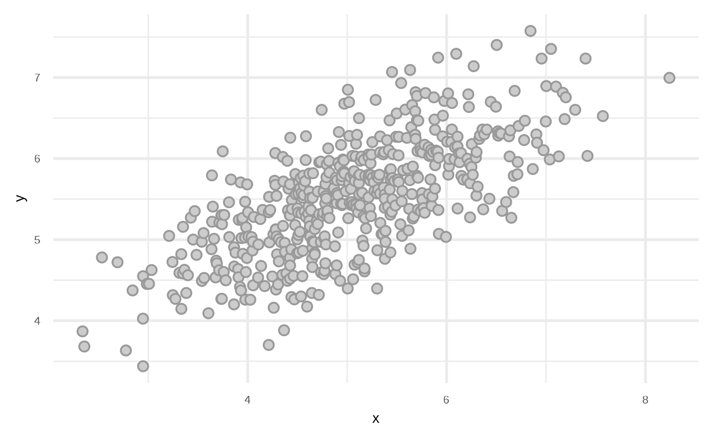
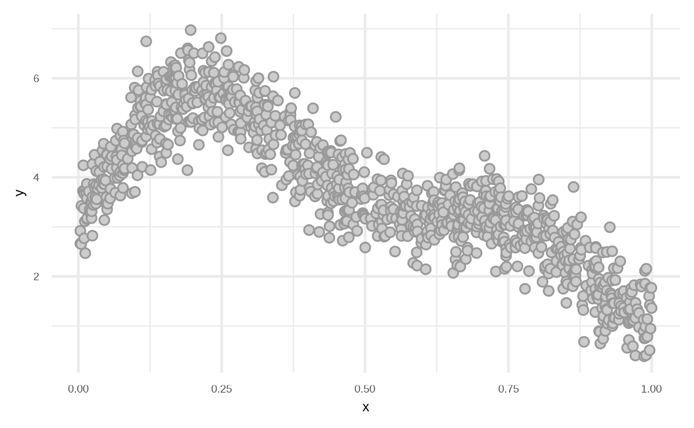
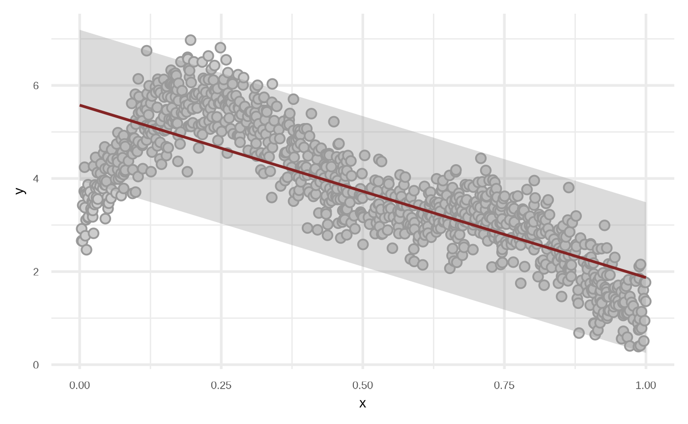
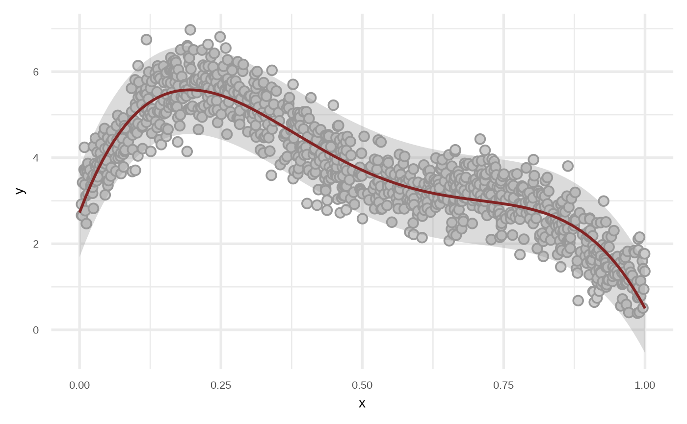
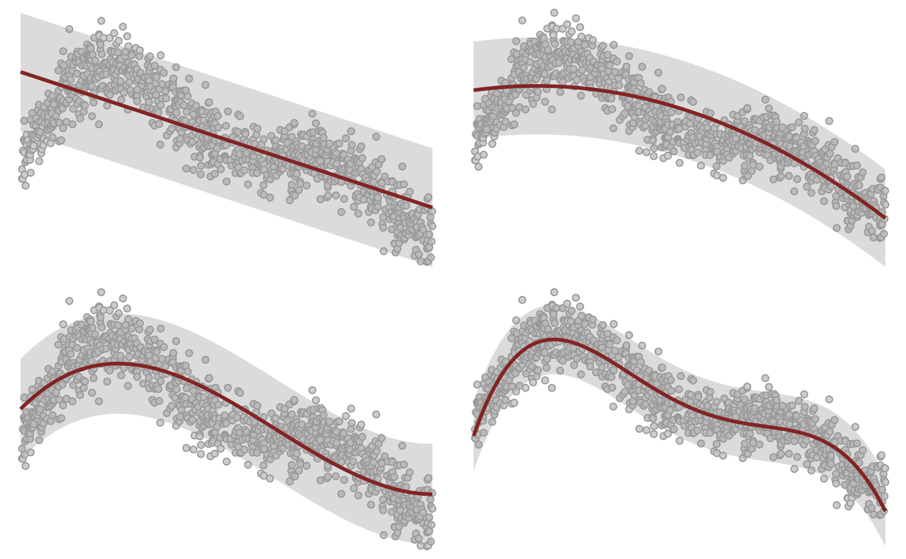
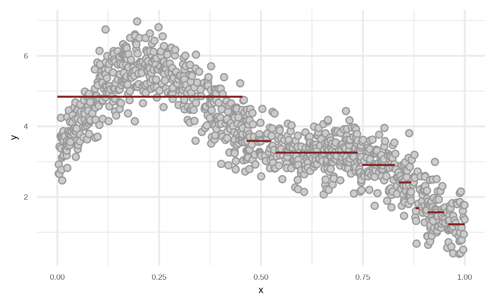
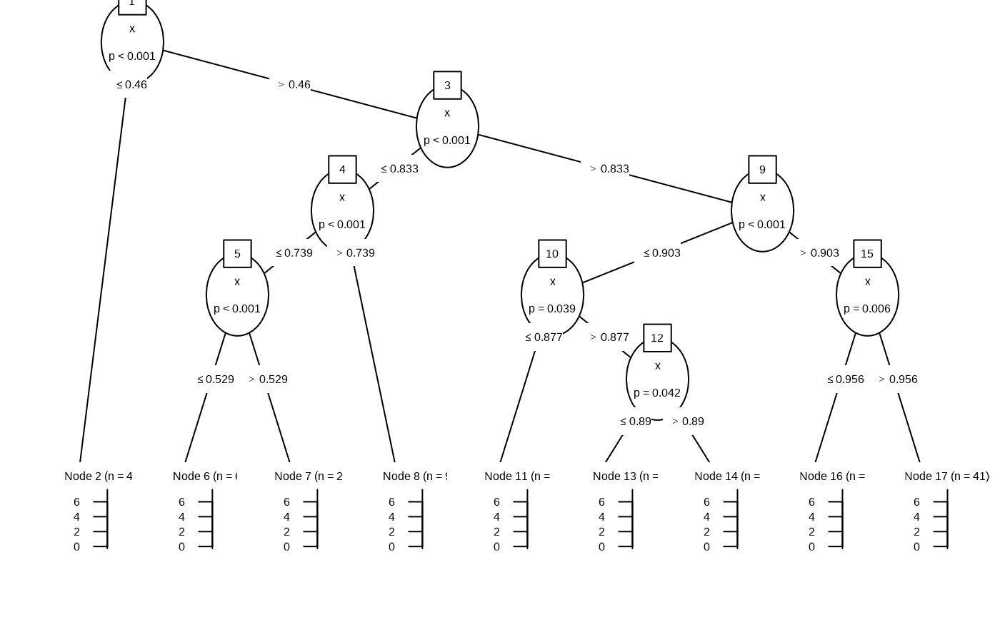
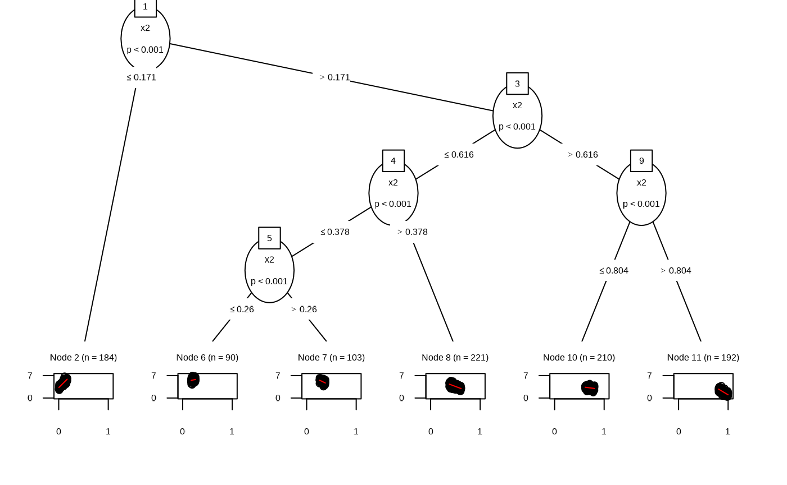
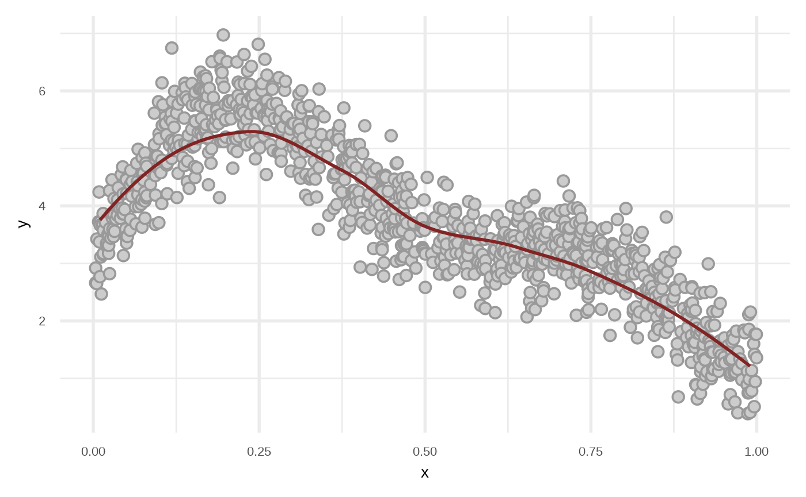
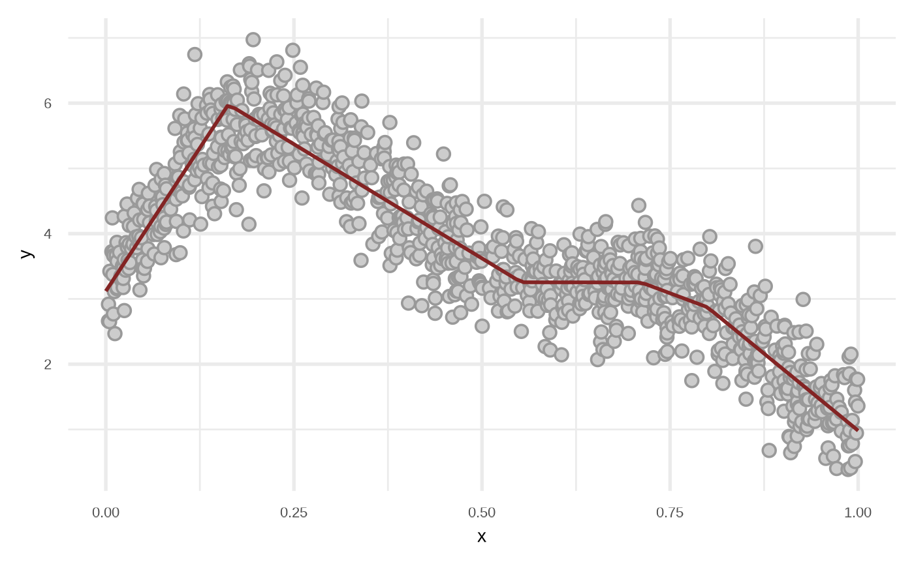

# Regression

## Generating data set

The main function is `sim_xy`, you need to define:

- A number of observations to simulate.
- Values $`\beta_0`$ and $`\beta_1`$.
- A distribution to sample $`x`$. For example
  [`stats::runif`](https://rdrr.io/r/stats/Uniform.html) or
  `purrr::partial(stats::rnorm, mean = 5, sd = 1)`.
- A function to sample error values like
  `purrr::partial(stats::rnorm, sd = 0.5)`.

``` r

library(klassets)
library(ggplot2)
library(patchwork)

set.seed(123)

df_default <- sim_xy()

df_default
#> # A tibble: 500 × 2
#>        x     y
#>    <dbl> <dbl>
#>  1  2.34  3.87
#>  2  2.36  3.68
#>  3  2.53  4.78
#>  4  2.69  4.72
#>  5  2.78  3.63
#>  6  2.84  4.37
#>  7  2.95  4.03
#>  8  2.95  3.44
#>  9  2.95  4.55
#> 10  2.99  4.45
#> # ℹ 490 more rows

plot(df_default)
```



We can modify the data frame to get other types of relationships.

``` r

df <- sim_xy(n = 1000, x_dist = runif)

df <- dplyr::mutate(df, y = y + 2*sin(5 * x) + sin(10 * x))

plot(df)
```



## Fit regression algorithms

### Linear Regression

This function uses [`stats::lm`](https://rdrr.io/r/stats/lm.html) to fit
a model.

``` r

df_lr <- fit_linear_model(df)

df_lr
#> # A tibble: 1,000 × 3
#>          x     y prediction
#>      <dbl> <dbl>      <dbl>
#>  1 0.00352  2.66       5.56
#>  2 0.00354  2.92       5.56
#>  3 0.00499  2.65       5.56
#>  4 0.00540  3.42       5.56
#>  5 0.00804  3.72       5.55
#>  6 0.00872  4.24       5.54
#>  7 0.00934  3.37       5.54
#>  8 0.0101   2.77       5.54
#>  9 0.0103   3.72       5.54
#> 10 0.0103   3.66       5.54
#> # ℹ 990 more rows

plot(df_lr)
```



By default the model use `order = 1` of the variables, i.e,
`response ~ x + y`. We can get a better fit if we increase the order.

``` r

df_lr2 <- fit_linear_model(df, order = 4, stepwise = TRUE)

attr(df_lr2, "model")
#> 
#> Call:
#> stats::lm(formula = y ~ x + x_2 + x_3 + x_4, data = df)
#> 
#> Coefficients:
#> (Intercept)            x          x_2          x_3          x_4  
#>       2.726       35.066     -137.903      186.228      -85.616

plot(df_lr2)
```



Testing various orders.

``` r

orders <- c(1, 2, 3, 4)

orders |> 
  purrr::map(fit_linear_model, df = df) |> 
  purrr::map(plot) |> 
  purrr::reduce(`+`) +
  patchwork::plot_layout(guides = "collect") &
  theme_void() + theme(legend.position = "none")
```



### Regression Tree

Internally the functions uses
[`partykit::ctree`](https://rdrr.io/pkg/partykit/man/ctree.html).

``` r

df_rt <- fit_regression_tree(df)

plot(df_rt)
```



``` r


plot(attr(df_rt, "model"))
```



### Linear Model Tree

Internally the functions uses `partykit::mltree`.

``` r

df_lmt <- fit_linear_model_tree(df)

plot(df_lmt)
```


``` r


plot(attr(df_lmt, "model"))
```



### Random Forest

Internally the functions uses
[`partykit::cforest`](https://rdrr.io/pkg/partykit/man/cforest.html).

``` r

df_rf <- fit_regression_random_forest(df)

plot(df_rf)
```


``` r


# this will be relative similar to `fit_regression_tree` due 
# we are using 1 tree
plot(fit_regression_random_forest(df, ntree = 1, maxdepth = 3))
```


### Local Polynomial Regression Fitting (LOESS)

Using [`stats::loess`](https://rdrr.io/r/stats/loess.html).

``` r

df_loess <- fit_loess(df)

plot(df_loess)
```



### Multivariate Adaptive Regression Splines (MARS)

Using [`earth::earth`](https://rdrr.io/pkg/earth/man/earth.html).

``` r

df_mars <- fit_mars(df)

plot(df_mars)
```


